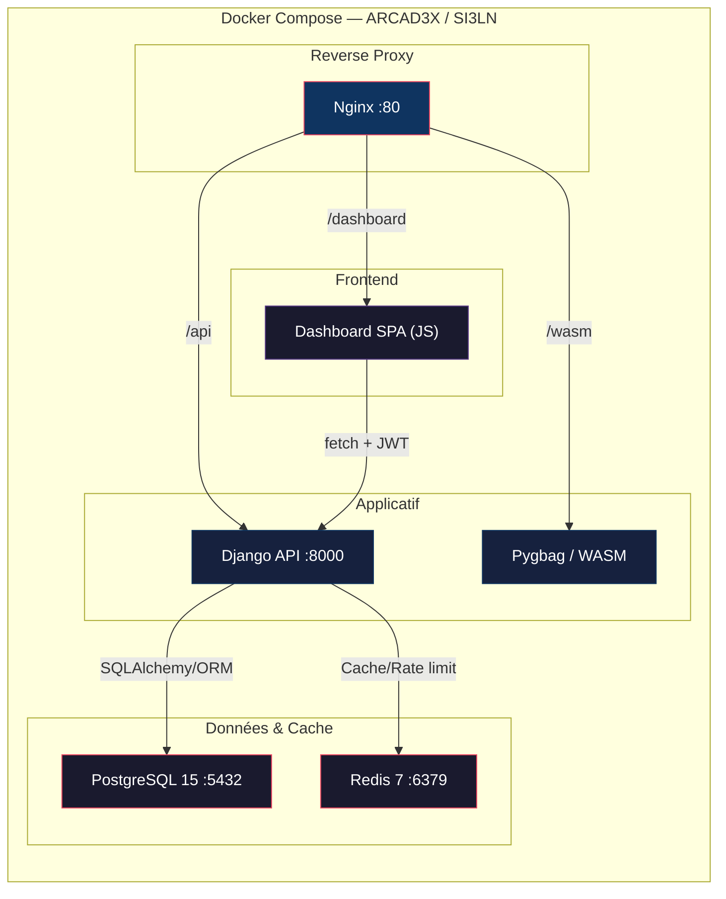

#  ARCAD3X / SI3LN — Notes de Présentation

> **Auteur :** Hugo Ramos (hugou74130)
> **Projet académique :** Holberton School France — Parcours SI3LN (Python Cohort)
> **Dernière mise à jour :** Juin 2026

---

##  Slide 1 — Page de Titre

**Titre :** ARCAD3X — Arcade Analytics Platform
**Sous-titre :** SI3LN (Space Invaders III Last Night) — Un écosystème gaming complet
**Nom / Cohort :** Hugo Ramos, SI3LN Python Cohort

---

##  Slide 2 — Présentation du Projet

### Qui a fait le projet ?
- **Hugo Ramos** — Full-Stack Game Developer (gameplay, visuels, optimisation)
- **Mélissa Sbibih** — Full-Stack Game Developer (architecture, data flow, documentation)

### Contexte
Projet académique réalisé dans le cadre du cursus à **Holberton School France**.
Débuté comme un simple jeu d'arcade, le projet a évolué en une **plateforme gaming full-stack** complète.

### Le projet en une phrase
> Un écosystème gaming complet combinant un jeu d'arcade 2D (style Space Invaders), une REST API sécurisée avec authentification, et un dashboard analytique web — le tout orchestré via Docker Compose.

### Les 3 modules
| Module | Rôle | Technologies |
|--------|------|-------------|
| **Game_Python** | Jeu d'arcade 2D (shoot 'em up spatial) | Python, Pygame, WASM (Pygbag) |
| **API** | Gestion sessions, scores, authentification, joueurs | Django + Django Ninja, PostgreSQL |
| **Dashboard Web** | Analytics, leaderboard, profils joueurs | HTML/CSS/JS vanilla (SPA) |

---

##  Slide 3 — D'où vient l'idée ?

### Inspiration
- **Space Invaders classique** → Le gameplay de base tire ses racines du shoot 'em up rétro
- **Problématique identifiée :** Les jeux d'arcade classiques offrent une expérience éphémère — pas de suivi de performance, pas d'historique, pas de comparaison entre joueurs
- **Solution proposée :** Coupler l'excitation du jeu d'arcade avec l'introspection de l'analytics

### Évolution du projet
```
V1 (Jeu seul)  →  V2 (Jeu + Auth + Scores)  →  V3 (Jeu + API + DB + Dashboard)
     Pygame           + Système de comptes         + Full-stack conteneurisé
```

---

##  Slide 4 — Technologies Utilisées

### Tech Stack & Justifications

| Choix | Technologie | Justification |
|-------|-----------|---------------|
| **Langage jeu** | Python / Pygame | Prototypage rapide, écosystème 2D riche, langage partagé avec l'API |
| **Déploiement web du jeu** | Pygbag (WebAssembly) | Permet de jouer au jeu Pygame dans un navigateur |
| **Framework API** | Django + Django Ninja | Admin panel intégré, ORM avec migrations, docs OpenAPI auto (`/api/docs`), validation Pydantic |
| **Base de données** | PostgreSQL 15 (Docker) | Production-ready, supporte les lectures/écritures concurrentes (MVCC) |
| **Cache / Rate limiting** | Redis 7 | Stockage des tokens blacklistés, limitation de débit |
| **Authentification** | Custom JWT (SHA-256 pepper) | Sécurité : rotation de tokens, expiration, protection brute-force |
| **Frontend dashboard** | HTML/CSS/JS vanilla | Pas de build step, architecture SPA modulaire |
| **Conteneurisation** | Docker Compose (5 services) | Environnement reproductible, un seul commande pour tout lancer |
| **Contrôle de version** | Git / GitHub | Git Flow simplifié, branches `feature/*`, PR avec double code review |

### Architecture Docker (5 services)



### Légende des flux

| Flux | Protocole | Description |
|------|-----------|-------------|
| `Nginx → Django` | HTTP reverse proxy | Requêtes `/api/*` → `:8000` |
| `Nginx → Pygbag` | Fichiers statiques | Build WASM servi comme assets |
| `Nginx → Dashboard` | Fichiers statiques | SPA vanilla JS |
| `Dashboard → API` | HTTP + JWT | `fetch()` avec `Authorization: Bearer` |
| `Django → PostgreSQL` | SQLAlchemy/ORM | CRUD sessions, scores, joueurs |
| `Django → Redis` | Protocole Redis | Rate limiting, cache tokens |

---

##  Slide 5 — Démo Live / Vidéo

### Points forts à montrer en démo
1. **Menu principal** → START (mode invité) vs CONTINUE (connexion)
2. **Sélection de personnage** → 8 personnages jouables
3. **Sélection de niveau** → Grille par monde (5 niveaux)
4. **Gameplay** → Contrôles fluides, collisions, HUD (score/vies/shield)
5. **Game Over** → Affichage du score + Top 20 leaderboard
6. **Dashboard web** → Leaderboard en temps réel, profils joueurs
7. **API docs** → Swagger UI auto-généré sur `/api/docs`

### Lancer la démo
```bash
# Cloner et lancer
git clone https://github.com/hugou74130/SI3LN_Python.git
cd SI3LN_Python/Docker
docker compose up --build

# Accès :
#   Dashboard  → http://localhost
#   API        → http://localhost:8000
#   API docs   → http://localhost:8000/api/docs
```

---

##  Slide 6 — Planning / Timeline

### Phases du projet

| Phase | Période | Contenu |
|-------|---------|---------|
| **Phase 1 — MVP** | ~Oct 2025 | Jeu Pygame basique : menu, gameplay, vies, collisions, écrans victoire/défaite |
| **Phase 2 — Auth & Scores** | ~Oct-Nov 2025 | Système de comptes (SHA-256), mode invité, sauvegarde scores JSON, profils |
| **Phase 3 — API REST** | ~Déc 2025 - Fév 2026 | Django Ninja API, PostgreSQL, JWT auth, endpoints CRUD, sécurité |
| **Phase 4 — Dashboard** | ~Mars-Avr 2026 | SPA vanilla JS, leaderboard, profils, intégration API |
| **Phase 5 — Docker & Polish** | ~Mai-Juin 2026 | Docker Compose 5 services, Pygbag WASM, tests, documentation |
| **Phase 6 — Features avancées** | Juin 2026 | Bootcamp/tutorial, shield, attaque spéciale, keybindings, audio SFX, HUD amélioré |

### Statistiques
- **82 commits** sur le repo
- **~22 000 lignes de code** (tous fichiers confondus)
- **67 fichiers Python** (modules, API, tests, scripts)
- **18 suites de tests automatisés**

---

##  Slide 7 — Leçons Apprises

### 🎓 Ce qui a bien marché
- **Architecture modulaire** : Séparer jeu, API et dashboard a permis le travail en parallèle
- **Conventional Commits** : `feat:`, `fix:`, `docs:` → historique Git lisible et professionnel
- **Docker Compose** : Un environnement reproductible = zéro problème "ça marche sur ma machine"
- **Django Ninja** : Docs OpenAPI auto-générées, validation Pydantic = gain de temps énorme
- **Sécurité par couches** : Facade pattern + middleware = défense en profondeur

###  Défis rencontrés
- **Merge conflicts** : Travail en parallèle sur `feature/*` branches → conflits fréquents sur `game.py` et `entities.py`
- **Intégration jeu ↔ API** : Faire communiquer le client Pygame avec l'API REST (gestion asynchrone, JWT)
- **Pygbag/WASM** : Compiler du Pygame pour le web → limitations (audio, performance)
- **Gestion des migrations Django** : Conflits de migration lors de modifications de modèles en parallèle
- **State machine du jeu** : Gérer les transitions entre menus, gameplay, pause, game over de manière propre

###  Ce qu'on ferait différemment
- Commencer avec Docker dès le début (pas seulement en Phase 5)
- Plus de tests unitaires dès le MVP (pas seulement en fin de projet)
- Utiliser un vrai framework frontend (React/Vue) pour le dashboard si le temps le permettait
- Implémenter le multijoueur (prévu en V3.0 mais pas encore fait)

---

##  Slide 8 — Version Post-MVP

### Fonctionnalités ajoutées après le MVP initial

| Version | Fonctionnalités |
|---------|----------------|
| **V1.0** | Jeu basique, menu, gameplay, vies, collisions |
| **V2.0** | Auth complète (SHA-256), profils, scores JSON, 8 personnages, 5 niveaux/monde, responsive |
| **V2.1** | API REST Django Ninja, PostgreSQL, JWT, endpoints CRUD, sécurité (rate limiting, XSS) |
| **V2.2** | Dashboard SPA vanilla JS, leaderboard temps réel, profils, i18n (EN/FR) |
| **V2.3** | Docker Compose (5 services), Pygbag WASM, 18 suites de tests, Swagger docs |
| **V2.4** (actuel) | Bootcamp/tutorial, shield, attaque spéciale, keybindings configurables, audio SFX, HUD avancé |

### Roadmap future (V3.0)
- Mode histoire avec cinématiques
- Nouveaux mondes (Desert, Ocean, Lava, Ice)
- Multijoueur local (écran partagé)
- Power-ups (vie, vitesse, multishot)
- Boss de fin de monde
- Système de quêtes quotidiennes

---

##  Slide 9 — Code Snippets

### Exemple 1 : Authentification JWT (création de token)
```python
# api/game/auth/jwt_auth.py
import jwt
import datetime

def create_token(user_id: int, username: str) -> str:
    payload = {
        "user_id": user_id,
        "username": username,
        "exp": datetime.datetime.utcnow() + datetime.timedelta(hours=24),
        "iat": datetime.datetime.utcnow(),
    }
    return jwt.encode(payload, SECRET_KEY, algorithm="HS256")
```

### Exemple 2 : Entité Player (Pygame)
```python
# Game_Python/entities.py
class Player(pygame.sprite.Sprite):
    def __init__(self, x, y, character_index=0):
        super().__init__()
        self.image = load_character(character_index)
        self.rect = self.image.get_rect(center=(x, y))
        self.speed = PLAYER_SPEED
        self.lives = MAX_LIVES  # 5
        self.shield = 0
        self.special_attack = 0

    def update(self, keys):
        if keys[pygame.K_LEFT] or keys[pygame.K_a]:
            self.rect.x -= self.speed
        if keys[pygame.K_RIGHT] or keys[pygame.K_d]:
            self.rect.x += self.speed
        # Limites de l'écran
        self.rect.clamp_ip(pygame.display.get_surface().get_rect())
```

### Exemple 3 : API Endpoint (Django Ninja)
```python
# api/game/api.py
from ninja import Router, Schema

router = Router()

class ScoreIn(Schema):
    score: int
    level_reached: int
    world_id: int

@router.post("/sessions", auth=JWTAuth())
def create_session(request, data: ScoreIn):
    session = GameSession.objects.create(
        player=request.auth,
        score=data.score,
        level_reached=data.level_reached,
        world_id=data.world_id,
    )
    return {"id": session.id, "score": session.score}
```

### Exemple 4 : Sécurité — Facade Pattern
```python
# api/game/facade.py
class ApiFacade:
    """Strippe les champs sensibles des réponses API"""
    SENSITIVE_FIELDS = {"password", "token", "secret", "jwt"}

    @staticmethod
    def sanitize_response(data: dict) -> dict:
        return {
            k: v for k, v in data.items()
            if k.lower() not in ApiFacade.SENSITIVE_FIELDS
        }
```

### Exemple 5 : Dashboard — Appel API (JS vanilla)
```javascript
// web_dashboard/src/api-facade.js
async function getLeaderboard(worldId = null, limit = 10) {
    let url = `/api/game/leaderboard?limit=${limit}`;
    if (worldId) url += `&world_id=${worldId}`;
    const res = await fetch(url, {
        headers: { "Authorization": `Bearer ${getToken()}` }
    });
    return await res.json();
}
```

---

##  Slide 10 — Outils de Collaboration

| Outil | Usage |
|-------|-------|
| **GitHub** | Hébergement code, Git Flow, Pull Requests |
| **Git branches** | `master` (stable) + `feature/*` (développement) |
| **Pull Requests** | Double code review obligatoire avant merge |
| **Conventional Commits** | `feat:`, `fix:`, `docs:`, `test:`, `refactor:` |
| **Discord** | Daily stand-ups, communication en temps réel |
| **Pair Programming** | Chaque feature conçue, implémentée et testée en binôme |
| **Docker Compose** | Environnement identique pour les deux développeurs |

---

##  Slide 11 — Défis Rencontrés (détaillé)

### 1. Communication Jeu ↔ API
Le client Pygame (desktop) doit communiquer avec l'API REST (serveur) via HTTP + JWT.
→ Solution : `api_client.py` dédié avec gestion des tokens, retry, et fallback mode offline.

### 2. Sécurité
Protéger l'API contre XSS, injection, brute-force, IDOR.
→ Solution : Security Facade (2 couches) + middleware Django + rate limiting Redis + validation Pydantic.

### 3. Gestion d'état du jeu
Transitions complexes entre : Menu → Auth → Sélecteur → Gameplay → Pause → Game Over → Leaderboard.
→ Solution : State machine propre dans `game.py` avec états explicites.

### 4. Déploiement WebAssembly
Compiler Pygame en WASM via Pygbag pour jouer dans le navigateur.
→ Solution : Dockerfile dédié (`Dockerfile.pygbag`) + volume partagé avec Nginx.

### 5. Tests
Couvrir un projet full-stack (jeu + API + dashboard) avec des tests automatisés.
→ Solution : 18 suites de tests couvrant auth, API, sécurité, E2E, performance, edge cases.

---

##  Slide 12 — Questions ?

### Liens utiles
- **Repo GitHub :** https://github.com/hugou74130/SI3LN_Python
- **API Docs (Swagger) :** http://localhost:8000/api/docs (quand l'API tourne)
- **Dashboard :** http://localhost (quand Docker tourne)

### Points à retenir
-  Projet **full-stack** : Jeu + API + Dashboard
-  **Sécurité** : JWT, SHA-256, rate limiting, XSS prevention
-  **18 suites de tests** automatisés
-  **Docker Compose** : 5 services, un seul `up --build`
-  **67 commits**, travail en binôme avec double code review
-  **Déployable** en local et en navigateur (WASM)

---

*Document préparé pour la présentation du projet ARCAD3X / SI3LN — Juin 2026*
