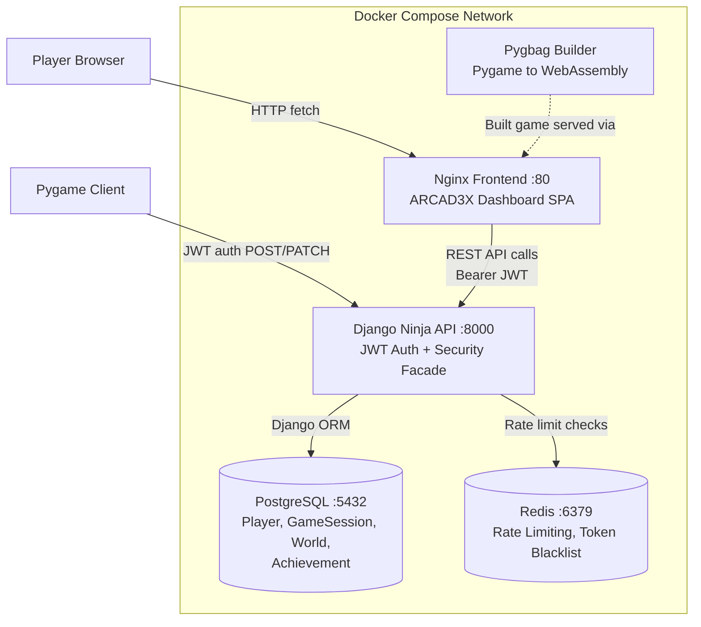
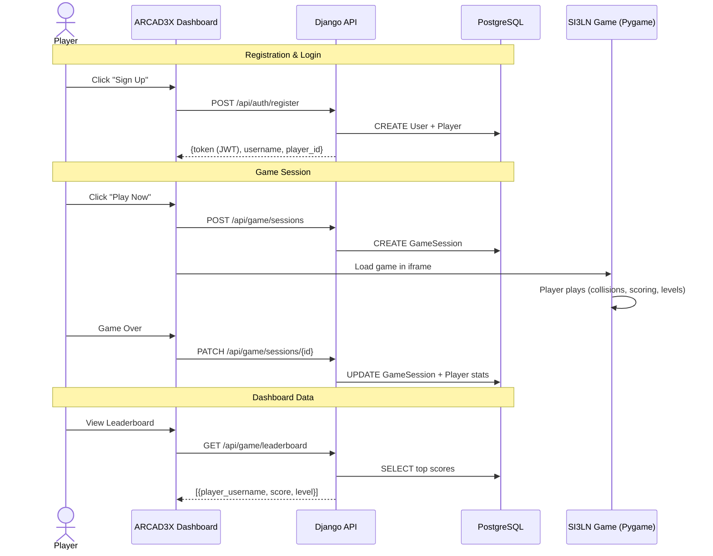
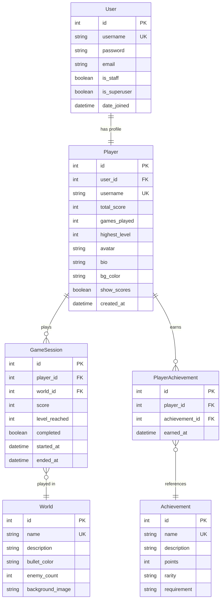

# 🎮 ARCAD3X: Arcade Analytics Platform

> **A complete gaming ecosystem** — Python/Pygame arcade game + Django Ninja REST API + Web analytics dashboard, orchestrated with Docker Compose.

[](https://python.org)
[](https://django-ninja.dev)
[](https://pygame.org)
[](https://docker.com)
[](https://postgresql.org)

---

## 📑 Table of Contents

- [🎮 ARCAD3X: Arcade Analytics Platform](#-arcad3x-arcade-analytics-platform)
  - [📑 Table of Contents](#-table-of-contents)
  - [🎯 Project Overview](#-project-overview)
    - [Problem Solved](#problem-solved)
  - [🏗 Application Architecture](#-application-architecture)
    - [Sequence Diagram (Typical Game Session)](#sequence-diagram-typical-game-session)
  - [🗄 Database Diagram](#-database-diagram)
  - [⚙ Tech Stack \& Justifications](#-tech-stack--justifications)
  - [📂 Project Structure](#-project-structure)
  - [🚀 Installation \& Setup](#-installation--setup)
    - [Prerequisites](#prerequisites)
    - [Option 1: With Docker (recommended)](#option-1-with-docker-recommended)
    - [Option 2: Manual setup](#option-2-manual-setup)
  - [🔌 API Specifications](#-api-specifications)
    - [Authentication (`/api/auth/`)](#authentication-apiauth)
    - [Game (`/api/game/`)](#game-apigame)
  - [🛡 Security](#-security)
  - [🧪 Tests](#-tests)
  - [👥 Team \& Collaboration](#-team--collaboration)
    - [Methodology](#methodology)
  - [📄 License](#-license)


## 🎯 Project Overview

**ARCAD3X** is a full-stack gaming platform where **SI3LN** (Space Invaders III Last Night) is deployed as the flagship arcade game. The project consists of three interconnected modules:

| Module | Role | Technologies |
|--------|------|-------------|
| **Game_Python** | 2D arcade game client (space shoot 'em up) | Python, Pygame, Pygbag (WebAssembly) |
| **api** | REST API for sessions, scores, authentication & player management | Python, Django, Django Ninja, PostgreSQL |
| **web_dashboard** | Analytics dashboard SPA with leaderboard & player profiles | HTML, CSS, JavaScript (vanilla) |

**Complete data flow:** Player plays → game client sends events to API → API stores in database → dashboard displays statistics and leaderboard.

### Problem Solved
Classic arcade games offer an ephemeral experience: players have no insight into their performance, trends, or history. ARCAD3X couples the thrill of arcade gaming with the introspection of analytics.

---

## 🏗 Application Architecture



### Sequence Diagram (Typical Game Session)



---

## 🗄 Database Diagram



**Key relationships:**
- **User → Player**: One-to-One (Django auth user linked to game player profile)
- **Player → GameSession**: One-to-Many (a player has many game sessions)
- **Player → PlayerAchievement**: One-to-Many (a player can earn many achievements)
- **GameSession → World**: Many-to-One (each session is played in one world)
- **PlayerAchievement → Achievement**: Many-to-One (each earned instance references one achievement)
- Guest players can play without an account — sessions are created without a `player_id`

---

## ⚙ Tech Stack & Justifications

| Choice | Technology | Justification |
|--------|-----------|---------------|
| **Game language** | Python / Pygame | Rapid prototyping, rich 2D ecosystem, shared language with API for stack consistency. Pygbag enables browser deployment via WebAssembly |
| **API framework** | Django + Django Ninja | Built-in admin panel, ORM with migrations, automatic OpenAPI docs at `/api/docs`, Pydantic validation for type-safe request/response schemas |
| **Database** | PostgreSQL 15 (Docker) | Production-ready, concurrent read/write support (MVCC), rich data types. SQLite kept as dev fallback |
| **Authentication** | Custom JWT (SHA-256 pepper, blacklisting, rate limiting) | Security-first approach with token rotation, expiry detection, and brute-force protection |
| **Dashboard frontend** | HTML / CSS / JavaScript (vanilla) | No build step required, SPA architecture with modular JS, API facade pattern for security |
| **Containerization** | Docker Compose (5 services) | Reproducible environment, isolated services, one-command startup |
| **Version control** | Git / GitHub | Simplified Git Flow with `feature/*` branches, pull requests and dual code review |

---

## 📂 Project Structure

```
SI3LN_Python/
├── Docker/                  # Docker configuration
│   └── docker-compose.yml   # 5 services: PostgreSQL, Redis, API, Nginx, Pygbag
├── Game_Python/             # Arcade game client
│   ├── game.py              # Main game loop & state machine
│   ├── entities.py          # Player, Enemy, Bullet, Bonus, Explosion
│   ├── constants.py         # Game configuration constants
│   ├── auth.py              # In-game authentication
│   ├── scores.py            # Score management & local leaderboard
│   ├── profile.py           # Player profile display
│   ├── level_selector.py    # World & level selection
│   ├── api_client.py        # HTTP client for API communication
│   ├── ui_components.py     # Reusable UI elements
│   └── config.ini           # User-editable settings
├── api/                     # Django Ninja REST API
│   ├── game/
│   │   ├── api.py           # Game endpoints (sessions, players, leaderboard)
│   │   ├── models.py        # Django ORM models
│   │   ├── schemas.py       # Pydantic request/response schemas
│   │   ├── facade.py        # Security facade (token sanitization, rate limiting)
│   │   └── auth/
│   │       ├── auth_api.py  # Auth endpoints (register, login, logout, refresh)
│   │       └── jwt_auth.py  # JWT token generation & validation
│   └── si3ln_api/
│       └── settings.py      # Django configuration
├── web_dashboard/           # ARCAD3X Dashboard SPA
│   ├── public/
│   │   ├── index.html       # Main page (694 LOC)
│   │   └── style.css        # Arcade-themed styles
│   └── src/
│       ├── app-refactored.js # AppManager (SPA routing)
│       ├── api.js            # Raw API client
│       ├── api-facade.js     # Security facade wrapper
│       ├── i18n.js           # Internationalization (EN/FR)
│       ├── mobile.js         # Mobile support
│       ├── help.js           # Help & support pages
│       └── search-service.js # Global search
├── Tests/                   # 18 automated test suites
│   ├── run_all_tests.py     # Test runner with color-coded output
│   ├── test_authentication.py
│   ├── test_api_full.py
│   ├── test_security.py
│   ├── test_e2e_flow.py
│   └── ...
├── env/                     # Environment configuration
└── .gitignore
```

---

## 🚀 Installation & Setup

### Prerequisites
- Python 3.10+
- Docker & Docker Compose (recommended)
- pip

### Option 1: With Docker (recommended)

```bash
git clone https://github.com/Schpser/SI3LN_Python.git
cd SI3LN_Python/Docker
docker-compose up --build
```

This starts 5 services: PostgreSQL, Redis, Django API (:8000), Nginx frontend (:80), and the Pygbag game builder.

### Option 2: Manual setup

```bash
# Clone the repository
git clone https://github.com/Schpser/SI3LN_Python.git
cd SI3LN_Python

# Install dependencies
pip install -r requirements.txt

# Run the API
cd api
python manage.py migrate
python manage.py runserver

# In another terminal, run the game
cd Game_Python
python game.py

# Dashboard is accessible at http://localhost (via Nginx) or served by the API
```

---

## 🔌 API Specifications

Auto-generated OpenAPI documentation available at `/api/docs` when the API is running.

### Authentication (`/api/auth/`)

| Endpoint | Method | Auth | Description |
|----------|--------|------|-------------|
| `/api/auth/register` | POST | Public | Register new user + player |
| `/api/auth/login` | POST | Public | Login, get JWT (24h) |
| `/api/auth/logout` | POST | Bearer | Logout, blacklist token |
| `/api/auth/refresh` | POST | Bearer | Rotate JWT token |
| `/api/auth/me` | GET | Bearer | Get current user info |
| `/api/auth/change-password` | POST | Bearer | Change password |
| `/api/auth/update-account` | PATCH | Bearer | Update email/name |

### Game (`/api/game/`)

| Endpoint | Method | Auth | Description |
|----------|--------|------|-------------|
| `/api/game/players` | GET/POST | Bearer/Public | List or create players |
| `/api/game/players/{id}` | GET/PUT/DELETE | Bearer | Player CRUD |
| `/api/game/sessions` | GET/POST | Bearer | List or create game sessions |
| `/api/game/sessions/{id}` | GET/PATCH/DELETE | Bearer | Session CRUD (PATCH auto-updates player stats) |
| `/api/game/leaderboard` | GET | Public | Leaderboard (filter: `?world_id=&limit=`) |
| `/api/game/stats` | GET | Public | Platform statistics |
| `/api/game/worlds` | GET | Public | List game worlds |
| `/api/game/achievements` | GET | Public | List achievements |
| `/api/game/profile/me` | GET/PATCH | Bearer | Player profile (stats, bio, settings) |
| `/api/game/profile/me/avatar` | POST | Bearer | Upload avatar (5MB max, magic-byte validation) |

---

## 🛡 Security

The application implements a **Security Facade pattern** (`game/facade.py`) with two layers:

- **`ApiFacade` class**: Strips sensitive fields from responses (passwords, tokens, internal IDs), replaces raw JWTs with opaque session identifiers, validates all inputs, and implements rate limiting (30 req/60s for auth, 5 req/60s for password changes)
- **`SecurityFacadeMiddleware`**: Django middleware that automatically adds security headers (`X-Content-Type-Options`, `X-Frame-Options`, `Referrer-Policy`, `Permissions-Policy`) and recursively sanitizes all JSON API responses as a safety net

Additional security measures: magic-byte validation on file uploads, XSS prevention (HTML tag stripping), CORS configuration, token blacklisting on logout.

---

## 🐛 Bug Tracking

Bugs are tracked via **GitHub Issues** on the repository.

| # | Title | Severity | Status |
|---|-------|----------|--------|
| [#1](https://github.com/Schpser/SI3LN_Python/issues) | Mermaid edge labels broken with quotes in diagram | Low | ✅ Fixed (commit `91d220e`) |
| [#2](https://github.com/Schpser/SI3LN_Python/issues) | SDL audio crash on headless server | Medium | ✅ Fixed (`SDL_AUDIODRIVER=dummy`) |
| [#3](https://github.com/Schpser/SI3LN_Python/issues) | Game client sends score before session created (race condition) | High | ✅ Fixed (`api_client.py` sequential flow) |
| [#4](https://github.com/Schpser/SI3LN_Python/issues) | Token not blacklisted on logout in Redis < 7 | Medium | ✅ Fixed (pinned Redis 7 in `docker-compose.yml`) |
| [#5](https://github.com/Schpser/SI3LN_Python/issues) | Avatar upload accepts SVG with embedded JS | High | ✅ Fixed (magic-byte validation + MIME whitelist) |

> Open a new issue: https://github.com/Schpser/SI3LN_Python/issues/new

---

## 🧪 Tests

18 automated test suites located in `Tests/`:

| Category | Suites | Focus |
|----------|--------|-------|
| Authentication | 2 | Login, register, logout, token validation, edge cases |
| API Endpoints | 2 | All REST endpoints, CRUD operations |
| Security | 3 | XSS, CORS, injection, rate limiting, IDOR prevention |
| Data & Validation | 2 | DB constraints, input validation, boundary values |
| E2E & Integration | 3 | Full flow, frontend, facade middleware |
| Edge Cases | 3 | Session, avatar, auth edge cases |
| Game Units | 1 | Offline entity logic (Player, Enemy, Bullet math) |
| Performance | 1 | Response times, concurrent requests |

```bash
# Run all test suites
cd Tests/
python run_all_tests.py

# Run a specific suite
python run_all_tests.py --suite auth
python run_all_tests.py --suite security
python run_all_tests.py --suite e2e
```

---

## 👥 Team & Collaboration

| Member | Role |
|--------|------|
| **Hugo Ramos** | Full-Stack Game Developer — gameplay, visuals & optimization |
| **Melissa Sbibih** | Full-Stack Game Developer — architecture, data flow & documentation |

### Methodology
- **Feature-Driven Pairing**: every feature is designed, implemented, and tested as a pair
- **Simplified Git Flow**: stable `master` branch, development in `feature/*` branches
- **Dual code review**: every pull request requires approval from both team members
- **Daily syncs**: daily stand-up sessions on Discord
- **Conventional Commits**: `feat:`, `fix:`, `docs:`, `test:`, `refactor:`, `chore:`

See [`SPRINTS.md`](./SPRINTS.md) for full sprint plans, MoSCoW prioritization, velocity tracking, and retrospectives.

---

## 📄 License

Academic project — Holberton School France

---

*Last updated: March 2026* 🚀