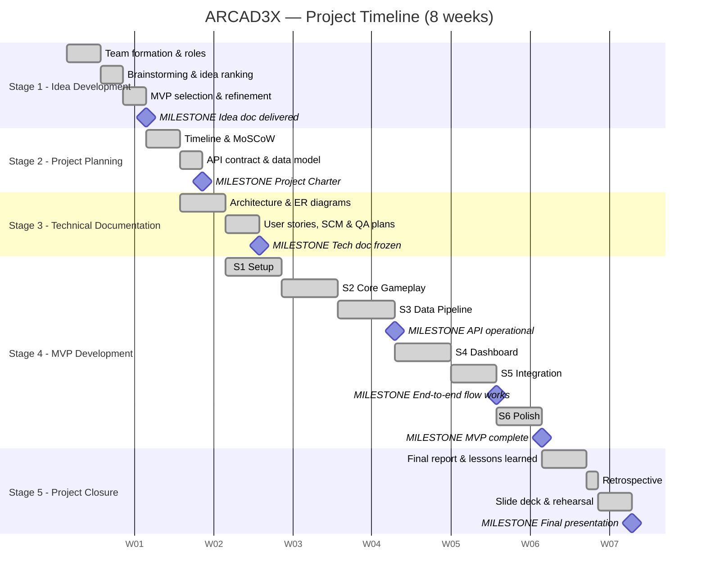

# ARCAD3X — Project Charter (Portfolio Part 2)

**Project:** ARCAD3X — Arcade Analytics Platform
**Flagship game:** SI3LN — Space Invaders III Last Night
**Team:** Hugo Ramos, Melissa Sbibih
**School:** Holberton School France
**Repository:** https://github.com/hugou74130/SI3LN_Python

---

## 1. Project Overview

| Field | Value |
|---|---|
| **Project name** | ARCAD3X — Arcade Analytics Platform |
| **Duration** | 8 weeks (Stages 1 → 5) |
| **Team size** | 2 |
| **Type** | Multi-client web platform (game client + REST API + analytics dashboard) |
| **Deliverable** | Functional MVP, containerized, documented and tested |

**Problem statement.** Classic arcade games offer an ephemeral experience: a run ends, a number appears, and everything that produced it is lost. Players have no visibility on their performance, no history, and no way to situate themselves relative to others.

**Solution.** A gaming ecosystem where every session is a data event: the game client submits structured session data to a REST API, the API persists it, and a dashboard turns it back into leaderboards, personal bests, achievements and statistics.

---

## 2. Objectives

| # | Objective | Success criterion |
|---|---|---|
| O1 | Playable arcade game client | Full state machine, 5 worlds, 7+ characters, desktop **and** browser (WASM) |
| O2 | Documented, secured REST API | 20+ endpoints, auto-generated OpenAPI, JWT with rotation and blacklisting, rate limiting |
| O3 | Analytics dashboard | SPA consuming strictly the same public API as the game client |
| O4 | Reproducible deployment | Single-command Docker Compose startup, 5 services |
| O5 | Automated test coverage | 15+ suites covering auth, endpoints, security and the end-to-end flow |

---

## 3. Scope

**In-scope**
Single-player arcade game (worlds, characters, levels, scoring) · shared JWT authentication for both clients · persistent game sessions with per-player statistics · leaderboard filterable by world · platform statistics · player profile with avatar upload · achievement system · EN/FR internationalization · responsive/mobile dashboard · Docker Compose deployment · automated test suite.

**Out-of-scope (V2.0)**
Real-time multiplayer · third-party OAuth · machine-learning analytics · public cloud deployment and full CI/CD · streaming/OBS overlay · native mobile applications.

---

## 4. Team & Stakeholders

| Member | Primary role | Domain |
|---|---|---|
| Hugo Ramos | Full-Stack Game Developer | Game engine, visual craftsmanship, gameplay feel, performance |
| Melissa Sbibih | Full-Stack Game Developer | System architecture, data flow, API design, documentation |

| Stakeholder | Interest | Influence |
|---|---|---|
| Teaching team (Rami & pedagogical staff) | Validation, curriculum alignment, grading | High |
| Cross-cohort peers | Shared feedback, peer review | Medium |
| Players / end users | Game experience, dashboard usability | High |
| Platform admins | Analytics access, user management, moderation | Medium |

**Working method:** *Feature-Driven Pairing* — every feature is designed, implemented and tested across all three layers by both members. Simplified Git Flow (`master` + `feature/*`), Conventional Commits, mandatory dual approval before merge, daily async stand-ups on Discord.

---

## 5. High-Level Plan

### 5.1 Stage timeline

| Stage | Period | Objective | Key milestones & deliverables | Status |
|---|---|---|---|---|
| **1 — Idea Development** | Week 1 | Concept, feasibility, team charter | Team formation & roles · brainstorming and idea ranking · MVP selection and refinement · idea development document | ✅ Done |
| **2 — Project Planning** | Week 2 | Timeline, prioritization, contracts | **Project Charter** · high-level plan & Gantt · MoSCoW prioritization · API contract agreed · data model defined | ✅ Done |
| **3 — Technical Documentation** | Weeks 2–3 | Architecture and quality plans | Architecture diagram · ER database diagram · sequence diagrams · user stories · SCM & QA plans | ✅ Done |
| **4 — MVP Development** | Weeks 3–6 | Build, integrate, test | 6 sprints (S1→S6) · working game client · 27 REST endpoints · dashboard SPA · 18 test suites · WASM build | ✅ Done |
| **5 — Project Closure** | Weeks 7–8 | Report, demo, presentation | Results summary · lessons learned · team retrospective · slide deck · live MVP demo | ✅ Done |

### 5.2 Sprint breakdown (Stage 4)

| Sprint | Focus | Key deliverables |
|---|---|---|
| **S1** — Setup | Environment & foundation | Docker Compose, Django scaffolding, Git Flow, CI |
| **S2** — Core Gameplay | Game engine | Pygame state machine, player/enemy entities, 5 worlds, 7 characters |
| **S3** — Data Pipeline | API integration | 27 REST endpoints, JWT auth, game → API score submission |
| **S4** — Dashboard | Frontend SPA | Auth UI, profile, leaderboard, games page, global search |
| **S5** — Integration | End-to-end | Full pipeline, token lifecycle, 18 automated test suites |
| **S6** — Polish | Finalization | Arcade assets, fonts, Pygbag WASM build, documentation |

### 5.3 Gantt chart

> Dates are indicative and map the 8-week structure onto a calendar; the sequence, durations and milestones are what matter here.

### 5.4 Critical milestones

| # | Milestone | Stage | Why it is critical |
|---|---|---|---|
| M1 | Idea document delivered | 1 | Nothing can be planned before the MVP is chosen |
| M2 | Project Charter approved | 2 | Freezes scope; every later scope discussion refers back to it |
| M3 | Technical documentation frozen | 3 | The API contract must exist before parallel development starts |
| M4 | API operational | S3 | Unblocks the dashboard — the hardest dependency in the project |
| M5 | End-to-end flow working | S5 | The first moment the three modules genuinely work together |
| M6 | MVP complete | S6 | Feature freeze; only bug fixes after this point |
| M7 | Final presentation delivered | 5 | Project closure |

---

## 6. Prioritization (MoSCoW)

| Priority | Tasks | Completed | Rate |
|---|---|---|---|
| Must Have | 20 | 20 | **100 %** |
| Should Have | 12 | 10 | 83 % |
| Could Have | 5 | 5 | 100 % |
| Won't Have (V2.0) | 3 | — | Deferred: multiplayer, OAuth, ML analytics |

**Overall velocity: 38/40 tasks completed (95 %), 6/6 sprints delivered on time.**

---

## 7. Risks and Mitigations

| Risk | Likelihood | Impact | Mitigation |
|---|---|---|---|
| Scope creep on game content | High | High | MoSCoW frozen at Stage 2; extra content only after API and dashboard are complete |
| Integration left until the final week | Medium | Critical | API contract agreed at Stage 3; end-to-end flow wired in S3, not S6 |
| Divergent development environments | High | Medium | Docker Compose from S1; the stack is never run outside containers |
| Pygbag/WASM build harder than expected | Medium | Medium | Classified Should-Have; the desktop client stays the reference target |
| Security added late and superficially | Medium | High | Security Facade designed as an architectural component in S3; dedicated security suites |
| Two-person team, one member unavailable | Low | High | Shared ownership, mandatory dual review, no layer known by only one person |

---

## 8. Definition of Done

A feature is considered done when it is: implemented across all affected layers · covered by at least one automated test · reviewed and approved by both team members · merged into `master` via a `feature/*` branch · and documented where it changes the API contract or the architecture.
